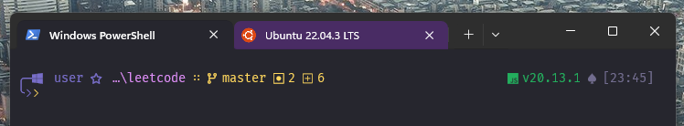
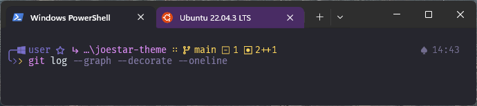

# ★ Joestar Theme
**JJBA** inspired [Starship](https://starship.rs/) prompt and color theme for [Windows Terminal](https://github.com/microsoft/terminal) and [zsh-syntax-highlighting](https://github.com/zsh-users/zsh-syntax-highlighting).




## Prompt Installation

### Starship
For both Windows Terminal and zsh-syntax-highlighting you of course need to install [Starship](https://starship.rs/). Starship is fast and easy customizible cross-shell prompt. Installation is simple, just look for the instractions on the main page.

### Icons 
Use [Nerd Font](https://www.nerdfonts.com/). Every font there has icons embedded. I prefer and also use [FiraCode](https://github.com/tonsky/FiraCode) for Joestar theme.

### Add Prompt
Copy content of the `starship.toml` from this repository into your `~/.config/starship.toml` on Linux, or `/Users/{user}/.config/starship.toml` on Windows (or whenever your `$HOME` variable points).

Add init script to your shell as it says Starship [install guide](https://starship.rs/#powershell).

## Color Theme
### Windows Terminal
In your windows terminal open Settings and click "*Open json*" to open your `settings.json`. Past the content of the `joestar-windows-terminal.json` into `schemes` section and save changes. Now you can activate Joestar Bizzare colors in the Terminal settings!

### Zsh-syntax-highlighting
Copy content of the `joestar-zsh-syntax-highlighting.zsh` into your `~/.zshrc` but before syntax highlighting initialization. 
```zsh
source ~/.zshrc
```
Done!

## Common problems
It happens sometimes that Powershell doesn't start prompt because of `$PROFILE` execution policy. Next commands may help you:
```pwsh
# Creates Powershell config file if it's not exists
# and adds starship initialization
Add-Content -Path $PROFILE -Value 'Invoke-Expression (&starship init powershell)'

Set-ExecutionPolicy RemoteSigned -Force
```

### Thats it!
